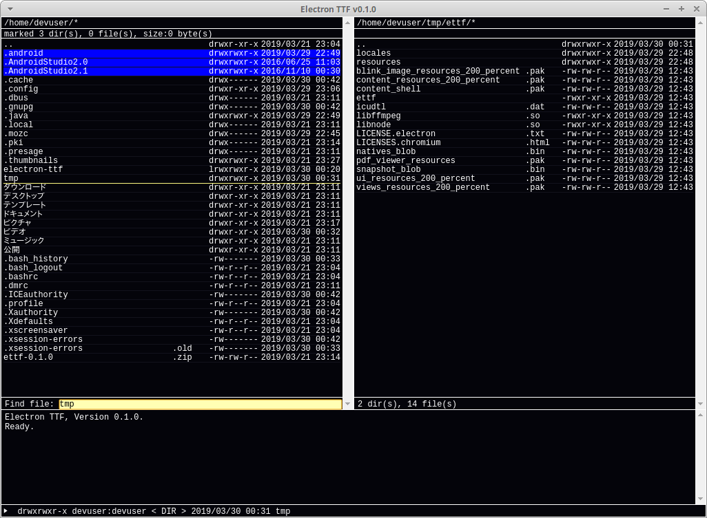
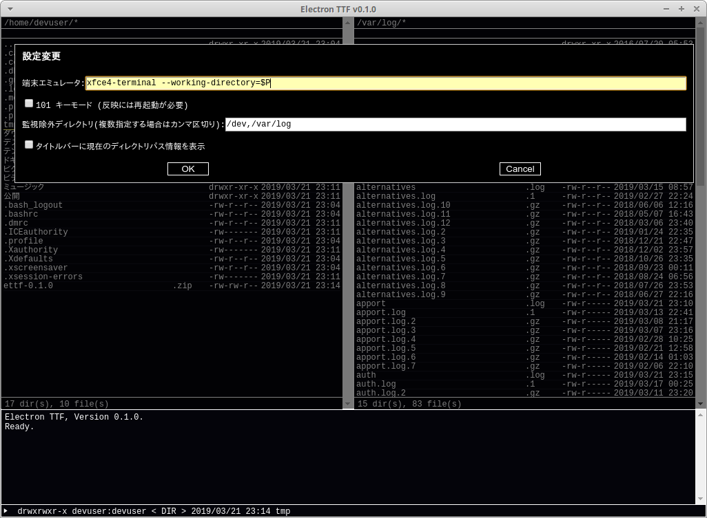

# Electron TTF (Tiny TF)



## 概要

いわゆる2画面ファイラ。

X680x0 用アプリケーションである TF.x の頃から2画面ファイラを使い続け、未だに他のファイルマネージャに慣れない私が、
Linux 環境でも2画面ファイラを使いたくなったので、Electron と React の勉強を兼ねて作り始めたもの。

基本的には [ＡＫＴ氏](http://akt.d.dooo.jp/akt_prf.html)作の [あふｗ](http://akt.d.dooo.jp/akt_afxw.html)
をリファレンスとした劣化コピー、というスタンスなので、本家が使える環境ではそちらを使ってください(作者もそうしている)。

「あふｗ」の `READMEW.TXT` より引用。まさにこれが開発動機であり、ある種の呪縛でもある。

```text
  卵からかえった雛鳥が最初に見たものを親と思うように、私が最初に
  使用したファイラーが TF.x でしたので、これ以外のモノは考えられない
  体となってしまったようです。
```

なお、開発者がこれ以外でのキーバインドであふを使ったことが無い、という理由により、
いわゆる TF.x 互換モード + 101 キーモードのキーバインドになっている。

## 起動方法

```bash
$ git clone git@github.com:teknocat/electron-ttf.git
$ cd electron-ttf
$ npm install
$ npm run dev
```

あるいは、アーカイブを展開して実行ファイル(`ettf`/`Electron TTF.exe`)を起動。

## 実装済機能

### キー操作

#### あふ準拠 (※一部機能の相違有)

- <kbd>↑</kbd> / <kbd>↓</kbd> : カーソル移動
- <kbd>←</kbd> / <kbd>→</kbd> / <kbd>Tab</kbd> : 相手窓にカーソルを変更

- <kbd>1</kbd> : ファイル表示タイプの変更
  - ファイルサイズ
  - ファイル所有者
  - ファイル権限

- <kbd>a</kbd> / <kbd>Home</kbd> : アクティブ窓の全ファイルのマーク、マーク解除(トグル動作)
- <kbd>A</kbd> / <kbd>Shift+Home</kbd> : アクティブ窓の全アイテム(ファイル、ディレクトリ)のマーク、マーク解除(トグル動作)
- <kbd>c</kbd> : マークされたファイル、ディレクトリを相手窓にコピー
  - ファイルが存在している場合の確認ダイアログで、上書きかファイル名を変更してコピーするか選択可能
    - 新しければ上書き： 対象ディレクトリが新しい場合に上書き
    - 新しければ上書き(サブディレクトリ対象): 対象ディレクトリに関係なく、サブディレクトリ、ファイルが新しいファイルを上書き(`rsync -u`)
  - ファイルが存在している場合の確認ダイアログにて、<kbd>Shift</kbd>を押しながらOKを押すことで、
    それ以降のダイアログを省略(すべてOKを押したことにする)
- <kbd>f</kbd> : ファイル、ディレクトリのインクリメンタルサーチ
- <kbd>h</kbd> : 履歴からのディレクトリ移動
- <kbd>j</kbd> : 登録パスリストからのディレクトリ移動
- <kbd>J</kbd> : 指定ディレクトリへ移動
- <kbd>k</kbd> : マークされたファイルを削除
  - 確認ダイアログの仕様はコピーと同様
- <kbd>m</kbd> :
  - マークなし：ディレクトリ作成＆作成ディレクトリへ移動
  - マークあり：相手窓にファイル、ディレクトリを移動
- <kbd>o</kbd> : アクティブ窓のディレクトリを相手窓のディレクトリに変更
- <kbd>O</kbd> : 相手窓のディレクトリをアクティブ窓のディレクトリに変更
- <kbd>q</kbd> : 終了
- <kbd>Q</kbd> : 設定保存なし終了
- <kbd>r</kbd> : ファイル、ディレクトリ名、権限、ファイルタイムスタンプ変更
- <kbd>s</kbd> : ファイルソートタイプ変更
- <kbd>x</kbd> : カーソル位置のファイル、ディレクトリを引数にコマンド実行
- <kbd>X</kbd> : コマンド実行
- <kbd>z</kbd> : 設定画面起動
  - 設定項目
    - 端末エミュレータ: 端末エミュレータ起動時に使用するコマンド名
      - 初期値(Windows): `start cmd.exe`
      - 初期値(それ以外): `xfce4-terminal --working-directory=$P` ($Pは対象ディレクトリのフルパスを展開)
        - 例えば CentOS の場合は `xfce4-terminal` を `gnome-terminal` に変更する
    - 101キーモード： 一部のキーバインドを101キー(US)仕様にする(※要再起動)
      - アプリケーション名、バージョン表示: <kbd>/</kbd> → <kbd>]</kbd>
      - カーソル位置のパスをクリップボードにコピー: <kbd>Alt+_</kbd> → <kbd>Alt+/</kbd>
    - 監視除外ディレクトリ: ディレクトリ内のファイル更新に合わせて再読み込みするための監視動作を行わないディレクトリをカンマ区切りで指定
    - タイトルバーに現在のディレクトリパス情報を表示



- <kbd>Ctrl+英数記号</kbd> : 指定英数記号で始まるファイル、ディレクトリにカーソルを移動
  - <kbd>Shift</kbd> を組み合わせたキーにも一部対応
  - **Window Managerのキーバインドとぶつかる組み合わせあり**  

- <kbd>\\</kbd> : ルートディレクトリに移動
- <kbd>/</kbd> (101 キーモード有効時は <kbd>]</kbd>) : アプリケーション名、バージョン表示
- <kbd>:</kbd> : ファイル・ディレクトリマスクの設定(デフォルトは `*`)
- <kbd>Ctrl+Enter</kbd> : デスクトップシステムで定義された動作を実行
- <kbd>PageUp</kbd> / <kbd>PageDown</kbd> / <kbd>Ctrl+↑</kbd> / <kbd>Ctrl+↓</kbd> : カーソルをページ単位で移動
- <kbd>Backspace</kbd> : 親ディレクトリへ移動
- <kbd>End</kbd> : 一覧の再読み込み(アイテムマーク解除)
- <kbd>Ctrl+End</kbd> : 一覧の再読み込み(アイテムマーク保持)
- <kbd>Shift+End</kbd> : 非アクティブ窓一覧の再読み込み(アイテムマーク解除)
- <kbd>Ctrl+Shift+End</kbd> : 非アクティブ窓一覧の再読み込み(アイテムマーク保持)
- <kbd>Space</kbd> : アイテムマーク、マーク解除(トグル動作)
- <kbd>Ctrl+Space</kbd> / <kbd>Shift+Ctrl+Space</kbd> : 上下マーク位置からの範囲マーク
- <kbd>Alt+\\</kbd> (101 キーモード有効時は <kbd>Alt+/</kbd>) : カーソル位置のパスをクリップボードにコピー
  - **<kbd>\\</kbd>が判別出来ないため、実質<kbd>Alt+￥</kbd>として動作**

#### オリジナル

- <kbd>Ctrl+\\</kbd> : ユーザホームディレクトリへ移動
- <kbd>Ctrl+Shift+Enter</kbd> : カーソルがディレクトリの場合、設定した端末エミュレータを起動

### コマンドラインオプション

- `-L ディレクトリ` 左窓に表示するディレクトリを指定
- `-R ディレクトリ` 右窓に表示するディレクトリを指定
- `--debug` DevToolsを開く
- `--help` ヘルプ表示
- `--version` バージョン表示
- `--enable-copy-to-fuse` FUSE ファイルシステム(gvfsなど)に対するコピーを有効にする
  - CentOS7でファイルが壊れる現象が発生したため、デフォルトではオフにしている。
    **事前にrsync/cpでコピーを実施し、問題が発生しない環境でのみ有効にすること**

### その他機能

- 表示ディレクトリのディレクトリ数、ファイル数表示
- マークしたディレクトリ数、ファイル数、ファイルサイズ表示
- 設定保持(ローカル)
  - 保存内容
    - 最後に開いていたディレクリ
    - ファイル表示タイプ
    - ファイルソートタイプ
- ディレクトリ変更監視
- カーソル位置の情報をステータスバーに表示

## 制限事項

- 作者が英語キーボードユーザのため、日本語キーボードについては調整出来ていない可能性あり
- gvfsなどFUSEを使ったファイルシステムに対してはコピー処理を行わないようガードしている(CentOS7でファイルが壊れる現象が発生したため)
  - コピー処理を有効にしたい場合は `--enable-copy-to-fuse` オプションを指定
  - cifsマウントしたファイルシステムは問題ない
- ~~ファイルシステムをまたいだ移動処理が出来ない(node.js モジュールの制限)~~
  - 外部コマンドを使うことで一旦回避
- すでに存在しているディレクトリに対する移動については、移動先が空ディレクトリのみ可能(内部で呼んでいる `mv` の制約)
- Windows 版に関する様々な制約
  - Windows固有のファイル情報表示、操作が出来ない
  - ファイル操作中は停止出来ない
- macOS 環境を持っていないため未確認
- ファイルマスク機能はディレクトリにも作用
- 大量のディレクトリ、ファイルがあるディレクトリの表示、及びカーソル移動が遅くなる
- 日本語キーボードにおいて <kbd>Alt+\\</kbd> <kbd>Alt+_</kbd> が動作しない

## 未実装で実装したいもの(順不同)

- [ ] エンターキーでの拡張子別ビューア
- [ ] 再帰操作を自前で実装
  - 現在は外部コマンド、node モジュールにまかせている
- [ ] ファイル、パス入力時の補完機能
- [ ] ファイル検索
- [ ] プログラム実行
- [ ] エディタ起動
- [ ] ディレクトリが存在するファイルシステムの全体容量、空き容量表示
- [ ] smbスキーマ対応
- [x] 登録済ディレクトリへの作業ディレクトリ移動
- [ ] 登録済ディレクトリへのファイル移動
- [ ] 仮想フォルダ(アーカイバ)機能

## 実装予定のないもの

- 内部命令系
  - 外部シェルとの組み合わせで

## 無保証

このプログラムは無保証です。このソフトウェアを使用した結果生じた、いかなる損害に対しても、作者は何らの責任も負いません。

## ライセンス

The software is available as open source under the terms of the [MIT License](https://opensource.org/licenses/MIT).

## 作者

teknocat <teknocat@gmail.com>
